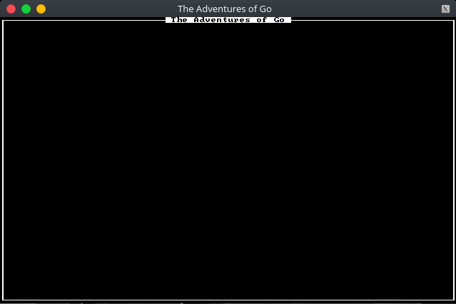

# tcod-go

[](https://pkg.go.dev/github.com/Joakker/tcod-go)

tcod-go is a port of the libtcod library to the Go language

## Installation

* You must have the [libtcod](https://www.github.com/libtcod/libtcod) library already
installed. This can be done by following the instructions in that repo.

Assuming you have the `go` executable in your `PATH` and you have
set up the `GOPATH` environment variable, simply run:

```sh
go get -v "github.com/Joakker/tcod-go"
```

and go should do everything else for you.

Unlike the C library, this binding provides a default font image, so you don't need
to provide your own.

## Minimal Program

Copy this into your text editor of choice and `go run` it

```go
package main

import (
    "log"

    "github.com/Joakker/tcod-go"
    "github.com/Joakker/tcod-go/input"
)

func main() {
    root, err := tcod.InitRoot(80, 50, "The adventures of Go", false, tcod.RenderSDL2)

    if err != nil {
        log.Fatal(err)
    }

    input := tinput.Input{}

    for !tcod.WindowClosed() {
        input.Check()
        root.Clear()
            root.PrintFrame(0, 0, 80, 50, false, "The adventures of Go")
        root.Flush()
    }
}
```

You should get something more or less like this:


## Contributing

Pull requests are not only welcome but encouraged. I started working on this
project very recently, so there is still a lot to be done, and even more I may
be overlooking.

## License

See [here](LICENSE)
